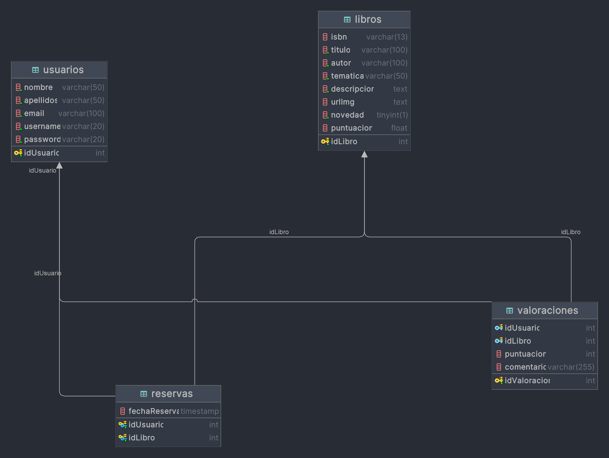

# Tecnologías utilizadas

- Bootstrap para el diseño de la página web.
- JavaScript para ciertas funcionalidades de la página web.
- Servlets para la gestión de las peticiones HTTP.
- JSP para la generación de las páginas web.
- MySQL para la persistencia de los datos.
- Maven para la gestión del proyecto.
- Tomcat para el despliegue de la aplicación web.

# Requisitos previos

- Tener instalado un servidor MySQL.
- Tener instalado un servidor Tomcat.
- Conservar el POM.xml original del proyecto.
- En el servidor de MYSQL ejecutar el comando `source src/main/webapp/WEB-INF/conf/tw.sql` o copiar y pegar el contenido del fichero `src/main/webapp/WEB-INF/conf/tw.sql` en la consola de MySQL para crear el usuario, la base de datos y las tablas necesarias.
- Por motivos de seguridad en el fichero `src/main/resources/config.properties` se encuentra las credenciales del administrador.
  - USERNAME=`admin`
  - PASSWORD=`admin123`.
  - Si se desea cambiar las credenciales, se debe modificar el fichero `src/main/resources/config.properties` y poner las credenciales deseadas siempre y cuando dichas credenciales existan en la base de datos.
- Modelo relacional de la base de datos:
  
